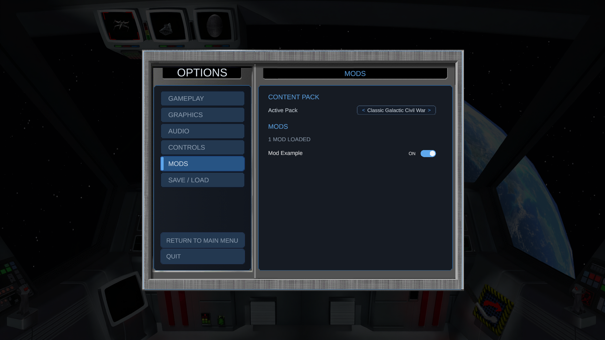

# Modding

Rebellion 2 loads modded art, audio, video, configuration, and game data from loose files. Most
content can therefore be changed without rebuilding the game.

## Creating a mod

A Rebellion 2 mod is a folder containing a `mod.xml` definition and a `Content` folder. It can
replace art, audio, video, configuration, or game-data files without rebuilding the game.

### 1. Find the Mods directory

Run Rebellion 2 once so the installer or launcher can finish creating the game directories. Open
the directory containing the installed `Content` folder, then open `Mods` beside it.

On Windows, the default installation has this layout:

```text
%LOCALAPPDATA%\Programs\AdasGames\Rebellion 2\
  Content\
  Mods\
  Rebellion2.exe
  rebellion2-launcher.exe
```

On macOS, `Content` and `Mods` are beside the application bundle:

```text
Rebellion 2 installation folder/
  Content/
  Mods/
  Rebellion2.app
```

When developing from the Unity project, use `Assets/Mods`.

### 2. Create the mod definition

Create a new folder directly inside `Mods`. For this example, create `ModExample`, then add a
`mod.xml` file containing:

```xml
<ContentModDefinition>
  <ID>mod-example</ID>
  <Version>1.0.0</Version>
  <DisplayName>Mod Example</DisplayName>
  <BasePackID>classic-galactic-civil-war</BasePackID>
</ContentModDefinition>
```

`ID` is the stable identifier stored in saves, `Version` identifies the installed revision, and
`DisplayName` is shown in the game. `BasePackID` limits the mod to that content pack. Omit
`BasePackID` only when the mod is compatible with every content pack.

### 3. Add replacement content

Create a `Content` folder beside `mod.xml`. Inside it, reproduce the path of every original file
the mod replaces. For example:

```text
Mods/
  ModExample/
    mod.xml
    Content/
      Pack/
        Factions/
          Alliance/
            Data/
              capital-ships.xml
      Application/
        MainMenu/
          UI/
            optional-replacement.png
```

A mod replaces a complete file at the matching logical path. It does not normally merge individual
objects or XML fields within that file. Files beneath the mod's `Content/Pack` directory replace
files from the selected base pack; files beneath `Content/Application` replace shared application
files. Copy the original file into the matching mod path, edit the copy, and leave the installed
`Content` file unchanged. The pack `game.xml` is the exception: it remains a sparse override merged
over the application `game.xml`.

### 4. Enable the mod

Launch Rebellion 2 and open **Options > Mods**. A compatible definition appears by its
`DisplayName`:



Use the switch to enable or disable the mod. Restart Rebellion 2 when prompted so the selected
content is reloaded. If the mod does not appear, confirm that `mod.xml` is directly inside the mod
folder and that its `BasePackID` matches the active content pack.

Mods load by folder name in ordinal order. If two enabled mods replace the same file, the later
folder wins. Custom load-order controls are not yet supported. Files not supplied by a mod fall back
to the selected content pack and then the shared application content.

## Sharing a mod

Package the mod folder containing `mod.xml` and `Content`; players install it by extracting that
folder directly into `Mods`. The installer, launcher, and application and content updaters do not
overwrite `Mods`.

Only distribute files you have the right to distribute. For mods based on the classic pack,
distribute only your mod definition and replacement files. Players and mod developers must own
*Star Wars: Rebellion* or *Star Wars: Empire at War: Gold Pack* and obtain the original content
through the ownership-verifying installer.

## Guides

- [Creating game events](Events/Index.md)
- [Creating and modifying units](Units/Index.md)

## Compatibility

Saves require the active pack ID, version, scenario, and ordered mod IDs and versions to match.
Increment a mod's version when publishing compatibility-breaking changes, then test both new games
and existing saves. Use the Options menu's Mods page to select a content pack and enable or disable
its compatible mods. Restart the game to apply those changes.
